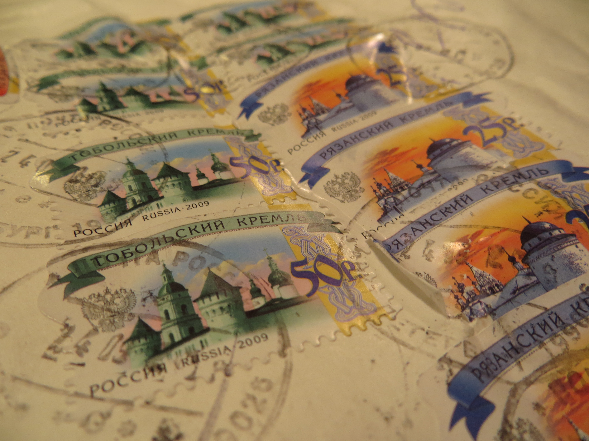
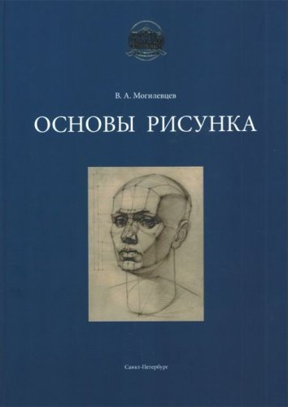

Arrived home to find a copy of [Основы Рисунка](http://www.amazon.com/gp/product/5903733018/ref=as_li_ss_tl?ie=UTF8&camp=1789&creative=390957&creativeASIN=5903733018&linkCode=as2&tag=micha0a3-20 "Основы Рисунка") waiting for me on the porch. Ordered from Amazon, shipped from St. Petersburg. Turns out my purchase of the hardcover book includes a PDF file with an English translation.

